# Architecture

MangaVault Desktop uses a strict split between a Rust local core and a React desktop UI.

## Layers

- `src-tauri/src/archive.rs`: archive, PDF, and image format detection, safe page listing, extraction limits, page byte loading.
- `src-tauri/src/scanner.rs`: recursive library discovery, metadata inference, page indexing.
- `src-tauri/src/db.rs`: SQLite migrations, repositories, FTS search, settings, progress, bookmarks.
- `src-tauri/src/extensions.rs`: provider interfaces, plugin manifest validation, safe external process execution, and future extension contracts.
- `src-tauri/src/logs.rs`: application log file listing for the reliability settings entry.
- `src-tauri/src/metadata.rs`: ComicInfo.xml parse/export helpers for the metadata extension boundary.
- `src-tauri/src/services.rs`: long-running workflows such as import and rescan.
- `src-tauri/src/commands.rs`: Tauri command boundary exposed to the UI.
- `src-tauri/src/lib.rs`: Tauri setup, system tray registration, plugins, and command registration.
- `src/stores`: Zustand app state for library and reader flows.
- `src/pages`: library, reader, and settings surfaces.
- `src/reader`: pure reader logic that is unit-tested in TypeScript.
- `src/components/Toaster.tsx`: application-level operation feedback through Radix Toast.

## Performance Design

- SQLite WAL mode keeps reads responsive during scan writes.
- Library queries are paged and indexed, with FTS5 for search.
- The grid uses virtual rendering for large collections.
- Reader page data is loaded on demand and kept in a bounded LRU-style cache.
- Cover and navigation thumbnails are generated by Rust and persisted in the disk thumbnail cache.
- Scanning runs in the Rust core and updates scan job state between candidates.
- Archive extraction rejects oversized entries to reduce decompression bomb risk.
- PDF pages are rendered on demand through the bundled Windows Poppler tool or a platform `pdftoppm`/`mutool` fallback, keeping rasterization outside the UI thread.
- Database health and backup commands use SQLite quick-check and timestamped local copies.
- Database maintenance commands expose SQLite optimize/analyze and optional vacuum actions through the settings performance entry.
- Extension providers are optional and disabled by default, so reader and scanner performance do not depend on AI, sync, OCR, translation, or upscale providers.
- Sync settings and logs are tracked through SQLite status commands; v1.0 exposes provider/conflict/encryption state without scheduling or contacting network services.
- OCR and translation settings are persisted separately from reader rendering; the v1.0 command surface only reports provider configuration and local cache counts.
- Local CLI image enhancement is invoked through argument arrays with path validation, timeout control, and stdout/stderr capture.
- Reader profile presets are persisted in SQLite and kept separate from the active reader store so future book-level and series-level overrides can be layered in without changing reader core logic.
- Smart collection rules are persisted in SQLite and surfaced from settings as local query definitions; v1.0 does not execute plugin-authored collection code.
- Plugin status is read from SQLite `plugin_manifests` and `plugin_settings`; the settings page reports manifest counts while dynamic execution remains hard-disabled.
- Navigation items, core commands, and layout normalization live in `src/lib/navigation.ts`; the sidebar, command palette, and settings page consume that registry instead of duplicating route definitions.
- Developer mode resources live in `src/lib/developerMode.ts`; v1.0 exposes local documentation and diagnostic switches without enabling plugin execution, tracing, or database browsing.
- Upscale cache cleanup removes database cache rows and deletes only files safely contained by the app cache `upscale` directory.
- ComicInfo.xml parsing and export are implemented as pure metadata helpers; v1.0 does not automatically rewrite imported archives.

## Database ER Diagram

```mermaid
erDiagram
  libraries ||--o{ books : contains
  series ||--o{ books : groups
  books ||--o{ chapters : has
  books ||--o{ pages : has
  books ||--o{ reading_history : records
  books ||--|| reading_progress : tracks
  books ||--o{ bookmarks : has
  books ||--o{ thumbnails : caches
  books ||--o{ book_tags : tagged
  tags ||--o{ book_tags : joins
  libraries ||--o{ scan_jobs : scans
  books ||--o{ metadata_history : records
  metadata_sources ||--o{ metadata_history : provides
  plugin_manifests ||--o{ plugin_settings : configures
  smart_collections ||--o{ books : filters
  ai_providers ||--o{ ai_tasks : runs
  ai_providers ||--o{ upscale_jobs : runs
  books ||--o{ upscale_jobs : enhances
  books ||--o{ upscale_cache : caches
  upscale_models ||--o{ upscale_cache : produces
  reader_profiles ||--o{ book_reader_settings : applies
  reader_profiles ||--o{ series_reader_settings : applies
  books ||--o{ book_reader_settings : overrides
  series ||--o{ series_reader_settings : overrides
  books ||--o{ ocr_cache : caches
  books ||--o{ translation_cache : caches
```

## Data Flow

1. User selects or drops a folder.
2. Rust canonicalizes the path and creates a scan job.
3. Scanner discovers archive files and image folders.
4. Each candidate is indexed into SQLite through an upsert transaction.
5. React reloads the virtualized library view from `list_books`.
6. Opening a book fetches chapters and pages, then loads visible page data on demand.
7. Progress and bookmarks are saved back through Tauri commands.
8. Cover and navigation thumbnails are generated by Rust and cached on disk.

## Extension Boundary

v1.0 reserves interfaces and schema for long-term growth without making optional
providers part of the reader core:

- Plugins: manifest validation, SQLite status reporting, and settings only; dynamic code execution is not enabled.
- Metadata: provider/parser contracts, filename parser, ComicInfo XML round-trip helpers, and metadata history schema.
- AI: local/cloud provider contracts and task schema; all AI flags are disabled by default.
- Upscale: a real local CLI provider boundary with safe process spawning; no models are bundled or downloaded.
- Reader profiles: global presets plus reserved book-level and series-level override tables.
- Library management: collection abstractions, persisted smart collection query records, duplicate detection, and file organizer service boundaries.
- UI: theme preset, layout, shortcut, navigation, and command registry settings seeded in SQLite; command contributions can be added later without changing reader core.
- Developer mode: local provider docs, plugin manifest docs, plugin example, ADR resource registry, and default-off diagnostics switches.
- OCR and translation: provider and cache contracts, default-off settings, and a settings status entry for future overlays.
- Sync: provider, conflict, log, encryption, and settings contracts; sync is disabled by default and manual-first.
- Telemetry and licensing: DB-backed default-off consent/status records plus service boundaries; no network transport is configured by default.

The extension migration is additive and does not alter existing book listing,
reader, scanner, or thumbnail queries.
